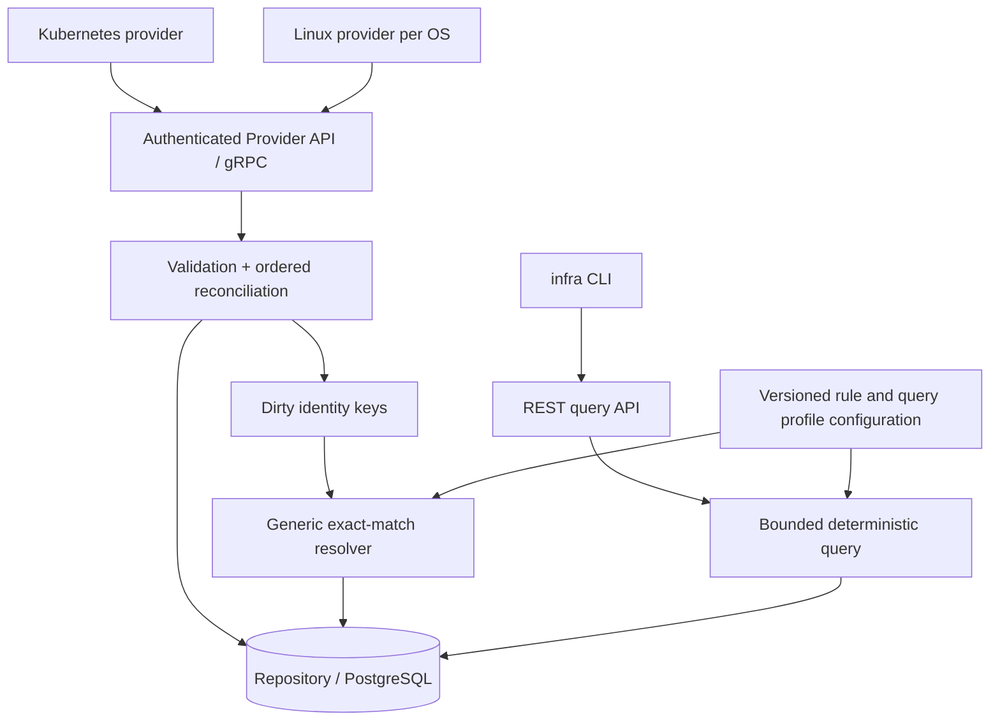

# InfraGraph v0.1 architecture review

Status: Initial proposal, partially superseded. 2026-09-21. 후속 대화에서 공통 service + CLI/tool adapter의 M1 구현을 시작했다. 아래 전체 provider/persistence/execution 설계가 일괄 확정된 것은 아니다.

후속 방향: 이 문서는 초기 topology 중심 검토다. 이후 논의에서 제품 목표가 장애 진단·추후 프로비저닝·사람과 외부 AI의 공통 운영 API로 구체화되었다. 제품 범위는 [후속 방향 문서](product-direction.md)가 우선하며 아래 마일스톤은 그에 맞춘 개정이 필요하다.

## 1. 제품에 대한 판단

처음부터 오픈소스로 시작할 수 있는 주제다. 다만 차별점은 “모든 인프라를 그래프로 표현한다”는 넓은 주장보다 **Kubernetes와 Linux 사이의 연결을 자동으로 만들고, 그 근거와 모르는 범위를 설명한다**는 좁고 검증 가능한 약속이어야 한다.

첫 사용자 가정은 Kubernetes 운영자다. 첫 질문은 “이 Deployment의 현재 Pod들은 어느 Linux OS에서 실행되며, 그 사실을 무엇으로 확인했는가?”다. `impact`는 두 번째 질문이고, 결과는 장애 확정이 아니라 **잠재 영향 범위**다.

Application은 v0.1에서 새 리소스로 자동 합성하지 않는다. Deployment를 시작점으로 삼는다. 공통 label이나 Service 이름이 같은 여러 workload를 하나의 Application으로 묶는 것은 별도 제품 결정이다.

원 명세에서 유지할 것: concrete resource, explicit relationship, provenance, provider isolation, PostgreSQL, deterministic traversal, read-only discovery, Linux OS visibility boundary.

원 명세에서 보완할 것: observation ownership, resource incarnation, collection coverage, relationship lifecycle, query-specific traversal, namespace-aware Linux identity, authenticated provider scope.

## 2. 기존 프로젝트·표준 검토

| 대상 | 확인한 사실 | InfraGraph 권고 |
|---|---|---|
| [Skydive](https://github.com/skydive-project/skydive) | agent가 topology/flow를 수집하고 중앙 분석기로 전달하는 기존 오픈소스 프로젝트 | discovery/graph 아이디어가 새롭다고 주장하지 않는다. v0.1은 provenance와 Kubernetes→Linux 식별 정확성으로 검증한다. flow 수집·UI·Gremlin은 가져오지 않는다. |
| [CloudQuery](https://github.com/cloudquery/cloudquery) | 여러 cloud/SaaS source의 데이터를 동기화하는 프로젝트 | provider 기반 inventory 수집 패턴은 참고하되, 현재 실행 위치와 관계 수명 모델이 우리의 초점이다. 해당 저장소만으로 전체 기능의 대체 가능성이나 부재를 단정하지 않는다. |
| [OTel resource conventions](https://opentelemetry.io/docs/specs/semconv/resource/k8s/) | `k8s.*` 속성과 cluster pseudo-ID 규약 제공 | 속성 이름과 cluster 식별 규약 재사용. OTel Resource를 통째로 InfraGraph Resource로 간주하지 않는다. |
| [OTel Entity Data Model](https://opentelemetry.io/docs/specs/otel/entities/data-model/) | infrastructure/runtime entity와 identifying attributes 모델을 별도로 다룸 | 식별 속성과 설명 속성의 분리를 참고한다. 개발 중인 명세에 wire protocol을 종속하지 않고 채택 버전을 기록한다. |
| [Kubernetes API](https://kubernetes.io/docs/reference/using-api/api-concepts/) | list/watch 및 resourceVersion 기반 연속 관측 제공 | client-go informer와 relist에 의존. resourceVersion은 opaque token이며 provider sequence로 대체 해석하지 않는다. |
| [Linux cgroup v2](https://cdn.kernel.org/doc/html/latest/admin-guide/cgroup-v2.html) | namespace에 따라 cgroup 경로의 관측 범위가 달라짐 | agent가 어떤 namespace를 보고 있는지 함께 기록한다. 컨테이너 내부 `/proc`를 host 전체로 오인하지 않는다. |

이 검토는 공개 문서 기반의 1차 검토다. 기존 프로젝트의 코드 품질, 최신 유지보수 상태, 모든 기능·라이선스 호환성을 실사한 결과는 아니다. 실제 라이브러리 도입 시 버전과 라이선스를 별도 고정한다.

## 3. 주요 문제와 v0.1 선택

### 3.1 Resource ID에 이름·provider process identity가 섞여 있다

- 문제: 예시의 `cluster/ns/Pod/name`은 재생성된 객체를 구분하지 못한다. provider 재배포가 identity 변경을 일으킬 수도 있다.
- 실패: `payment-api-abc` 삭제 후 같은 이름으로 생성하면 과거 Node 관계가 새 Pod에 붙는다.
- 대안: 이름 경로 / native UID / registry 발급 ID + native key. 이름은 읽기 쉽지만 incarnation을 잃고, native key만 쓰면 외부 API가 provider 형식에 묶인다.
- 권고: core가 opaque UUID를 발급한다. unique key는 `(provider_id, kind, native_id)`다. Kubernetes native ID는 object UID, provider scope는 cluster identity. 이름은 검색·표시용이다. 동일 name 조회가 모호하면 후보를 반환한다.

### 3.2 동일성을 증명하는 것과 동일 리소스로 합치는 것은 다르다

- 문제: Kubernetes Node는 API 객체, LinuxOS는 OS 설치 인스턴스다. 같은 물리 대상을 가리키는 증거가 있어도 둘의 lifecycle은 다르다.
- 실패: Node 재등록 시 LinuxOS가 삭제되거나 Kubernetes labels와 Linux attributes가 서로 덮어쓴다.
- 대안: canonical host로 merge / alias / 두 리소스를 연결. merge는 편하지만 정보와 삭제 권한이 충돌한다.
- 권고: merge하지 않는다. `kubernetes.Node BACKED_BY linux.OS`를 만든다. evidence와 rule version을 보존하고 증거가 사라지면 연결을 철회한다. 일반 alias subsystem은 유보한다.

### 3.3 Stable identifier도 충돌하거나 복제될 수 있다

- 문제: machine-id, DMI UUID, MAC을 전역적 진실로 취급할 수 없다.
- 실패: 복제 VM 두 대가 같은 machine-id를 가지면 한 Node에 LinuxOS 두 개가 붙거나 잘못된 서버에 연결된다.
- 대안: 하나의 값만 equality match / 복수 증거와 유일성 검증 / 명시적 binding. 단일 값은 간단하지만 오연결 위험이 크다. binding은 정확하지만 자동 discovery를 약화한다.
- 권고: 인증된 correlation domain 내에서 normalized exact match와 종류별 uniqueness를 확인한다. machine-id와 system UUID가 둘 다 존재하면 둘 다 일치해야 한다. 하나만 존재하면 그 종류의 유일성·유효성 검사를 통과해야 한다. placeholder, 빈 값, 다른 증거의 모순, 다중 후보는 자동 연결하지 않는다. hostname은 후보만 만든다. 이 규칙의 deterministic은 “규칙이 결정적”이라는 뜻이지 하드웨어 진실의 보장은 아니다.

### 3.4 Kubernetes Container가 선언인지 실행 인스턴스인지 불명확하다

- 문제: Pod UID와 container name은 재시작 후에도 유지될 수 있지만 runtime ID는 바뀐다.
- 실패: 이전 cgroup/process에 새 컨테이너를 연결한다.
- 대안: slot만 모델링 / slot과 runtime을 모두 모델링 / runtime만 resource로 모델링.
- 권고: v0.1 `kubernetes.Container`는 runtime instance로 정의한다. native key는 Pod UID + regular/init/ephemeral 분류 + container name + full runtime ID. runtime ID가 없는 pending container는 Pod의 선언 속성에 둔다. slot resource는 추가하지 않는다. 종료된 실행이 Kubernetes status에 남아 있으면 ACTIVE/terminated일 수 있다. 관측 freshness와 실행 상태는 별개다.

### 3.5 Heartbeat는 발견한 모든 리소스의 재확인이 아니다

- 문제: provider가 살아 있어도 Pod watch나 block-device collector만 실패할 수 있다.
- 실패: NIC collector는 성공하지만 mount 접근은 거부됨. 전체 scan 결과에서 mount가 사라져 삭제된다.
- 대안: provider 단위 TTL / collector 단위 coverage / 모든 객체 주기적 refresh. provider TTL은 단순하지만 오판하고 객체 refresh는 비용이 크다.
- 권고: provider 아래 collection scope를 둔다. scope는 kind/namespace/host collector 등의 고정된 범위를 소유한다. heartbeat, 성공한 coverage 확인, resource observation 시각을 분리한다. 삭제는 해당 scope의 완료된 snapshot 또는 authoritative delete로만 판정한다. partial/forbidden/timeout은 STALE 사유다.

### 3.6 재시작·역순 이벤트에 대한 권한과 순서가 없다

- 문제: timestamp 비교로는 clock skew, 재전송, 옛 프로세스의 지연 전송을 해결할 수 없다.
- 실패: delete 뒤에 오래된 upsert가 도착해 Pod가 부활한다. 재시작 전 provider가 새 provider 상태를 덮어쓴다.
- 대안: last-write-wins timestamp / per-object version / fenced session + ordered sequence.
- 권고: scope마다 core 발급 epoch와 연속 seq를 사용한다. 한 scope에 하나의 writer만 허용한다. 중복 `(epoch, seq)`는 같은 payload일 때만 성공, gap은 retry, 옛 epoch는 reject. 새 session은 scope 전체 snapshot을 완료해야 delta를 보낼 수 있다. 외부 source revision은 provenance용으로 보관한다.

### 3.7 관계에도 소유권과 수명이 필요하다

- 문제: 관계 하나를 여러 관측자가 지지할 수 있다. resource 삭제와 relation 삭제는 동일 작업이 아니다.
- 실패: Pod label 변경 후 예전 Service SELECTS 관계가 영구히 남거나, 한 provider의 삭제가 다른 provider의 증거까지 지운다.
- 대안: 유일 edge / provider별 edge / logical edge + assertion.
- 권고: 저장은 provider/scope별 assertion이다. 조회 시 `(source, type, target)`로 묶어 여러 provenance를 보여준다. assertion upsert는 attributes/evidence 전체 교체이며 key에는 endpoints/type도 포함한다. source object 갱신 시 그 객체가 소유한 assertion set을 원자 교체한다. endpoint 미발견 시 pending, 삭제 시 traversal 제외. pending을 fake resource로 승격하지 않는다.

### 3.8 Impact는 단순 reverse traversal가 아니다

- 문제: `Deployment OWNS ReplicaSet`과 `Pod RUNS_ON Node`의 의미가 다르다. 소속 관계가 장애 의존성을 뜻하지 않는다.
- 실패: Node→Pod→Namespace를 역탐색한 뒤 같은 Namespace의 모든 workload를 장애 대상으로 표시한다. 한 replica의 손실을 Service 전체 중단으로 단정한다.
- 대안: 모든 edge 역탐색 / 모든 edge를 DEPENDS_ON으로 바꿈 / 목적별 명시적 traversal profile.
- 권고: fact edge는 보존하고 `infrastructure/v1`, `potential-impact/v1`, `ownership/v1` profile을 데이터로 정의한다. default impact는 알려진 runtime/support 관계와 ownership 집계만 따른다. 결과에 경로·신선도·잠재 영향임을 표시한다. 가용성 계산·quorum·SLO 판정은 하지 않는다.

### 3.9 Selector는 트래픽의 증거가 아니다

- 문제: Service selector는 label match이고 실제 통신 관측이 아니다. selector 없는 Service도 있다.
- 실패: ready하지 않은 Pod를 정상 backend로 설명하거나 selector 없는 Service를 비어 있다고 단정한다.
- 대안: selector만 / EndpointSlice만 / 두 사실을 별도로 기록.
- 권고: `SELECTS`는 선언상 선택, Service→EndpointSlice→Pod는 게시된 endpoint 관계다. endpoint의 ready/serving/terminating 및 targetRef UID를 보존한다. targetRef 없는 주소는 Slice 속성으로 보존하며 IP만으로 Pod를 추정하지 않는다. 둘 다 “실제 트래픽이 흐른다”는 주장을 하지 않는다. [EndpointSlice API](https://kubernetes.io/docs/reference/kubernetes-api/discovery/endpoint-slice-v1/)

### 3.10 OS 객체는 namespace와 재사용을 고려해야 한다

- 문제: PID, ifindex, mount ID, major:minor는 시간과 namespace에 따라 재사용된다.
- 실패: PID 42의 새 프로세스가 이전 프로세스의 cgroup과 mount를 상속한 것으로 보인다.
- 대안: 숫자만 key / boot + namespace + native lifetime 정보 / 관측 generation.
- 권고: process는 OS + boot ID + PID + `/proc/PID/stat` starttime. network는 netns identity + ifindex + 관측 generation. mount는 mount namespace + mount ID + 관측 generation. 이벤트 유실/agent restart로 연속성이 불명확하면 새 generation으로 보수적으로 재발견한다. cgroup도 boot/hierarchy/inode와 generation을 사용한다. 안정성보다 오합병 방지를 우선한다.

### 3.11 Mount→Filesystem→BlockDevice는 항상 선형이 아니다

- 문제: tmpfs, overlay, NFS, bind mount, device-mapper, multi-device filesystem이 존재한다.
- 실패: overlay mount의 source 문자열을 물리 디스크로 만들거나 CSI volumeHandle을 `/dev/sdX`와 비교한다.
- 대안: generic Storage로 평탄화 / 모든 storage 계층 즉시 구현 / 관측 가능한 native 계층만 연결.
- 권고: Mount와 Filesystem을 구분하되 filesystem에 block backing이 없어도 정상이다. local block-backed filesystem은 OS/boot 범위에서 mountinfo와 sysfs의 검증된 device 대응만 연결한다. UUID 없는 filesystem은 observer-local identity로 유지한다. multi-device는 다중 edge 또는 미확인 상태다. CSI는 `(driver, volumeHandle)` 쌍을 보존하고 검증된 driver별 매핑 없이는 Linux와 연결하지 않는다. PVC→PV는 UID 검증을 포함한다. [Persistent Volumes](https://kubernetes.io/docs/concepts/storage/persistent-volumes/)

### 3.12 Bridge/Bond를 인터페이스와 중복 생성하면 같은 객체가 두 개가 된다

- 문제: Bridge와 Bond는 OS network link의 구체적인 종류다.
- 실패: 같은 ifindex의 `NetworkInterface`와 `Bridge`가 별개 리소스로 생겨 주소와 member edge가 분산된다.
- 대안: 중복 노드 + alias / 하나의 kind + subtype / concrete kind + capability tag.
- 권고: link당 한 resource. 일반 link는 `linux.NetworkInterface`, bridge는 `linux.Bridge`, bond는 `linux.Bond`. 모두 문서화된 `network-interface` capability로 조회 가능하되 v0.1 capability 실행 엔진은 없다. netlink native master/slave 관계를 보존한다.

### 3.13 최소 privilege와 자동 설치 사이에 실제 제약이 있다

- 문제: non-privileged Pod라고 host 정보 접근이 무위험하거나 모든 환경에서 가능하다는 뜻은 아니다.
- 실패: hostNetwork 없이 netlink로 agent Pod의 NIC만 수집해 host NIC로 게시한다. restricted admission이 hostPath를 거부해 Helm 설치가 실패한다.
- 대안: privileged DaemonSet / host namespace와 제한된 read mount / remote SSH polling.
- 권고: hostNetwork + 지정된 read-only host proc/sys/machine-id mount를 기본 host discovery profile로 검증한다. root filesystem 전체와 runtime socket은 mount하지 않는다. capability는 drop ALL, privilege escalation은 false. hostPID는 기본 false로 host proc bind 기반 관측을 먼저 검증한다. 권한 부족은 collector coverage에 남긴다. 프로세스·DMI 수집에 필요한 권한은 배포판별 테스트로 결정하며 무조건 root/SYS_ADMIN을 추가하지 않는다. [Pod Security Standards](https://kubernetes.io/docs/concepts/security/pod-security-standards/)

### 3.14 인증만 있고 관측 scope 권한이 없다

- 문제: 유효한 provider token으로 임의 node의 machine-id를 제출할 수 있으면 topology spoofing이 가능하다.
- 실패: 침해된 agent가 다른 노드의 OS 리소스를 덮어쓴다.
- 대안: 공용 token / provider별 credential / workload identity 기반 scope binding.
- 권고: Kubernetes는 audience-bound ServiceAccount token 검증과 bound Pod/Node 확인으로 scope를 할당한다. node 이름 문자열은 인증이 아니다. core의 TokenReview/필요한 Pod 조회 권한을 discovery RBAC와 분리한다. standalone은 관리자가 발급한 provider별 mTLS credential을 쓴다. provider는 자기 scope에만 쓸 수 있고 rule/profile 설치 권한은 없다. 인증된 provider의 거짓 관측 자체까지 방지하는 원격 증명은 v0.1 밖이다.

Pod-bound token의 Node 부가 정보는 TokenReview 성공만으로 현재 Node의 존재까지 검증된 것으로 취급하면 안 된다. core의 인증 adapter가 bound Pod UID, 현재 Pod의 nodeName, 현재 Node UID를 별도로 확인하고 권한 scope를 부여해야 한다. 이 Kubernetes 인증 adapter는 discovery/reconciliation business logic과 분리한다. [Kubernetes ServiceAccount 관리 문서](https://kubernetes.io/docs/reference/access-authn-authz/service-accounts-admin/)

### 3.15 규모를 정의하지 않으면 process graph가 제품을 삼킨다

- 문제: 모든 PID를 매우 짧은 주기로 기록하면 graph 업데이트와 디스크 쓰기가 대부분 process churn이 된다.
- 실패: API server와 core는 정상인데 Linux process 갱신으로 query latency가 증가한다.
- 대안: 실시간 모든 이벤트 / 주기적 snapshot / 필요한 collector부터 점진 확장.
- 권고: “현재 관측 가능한 topology”를 약속하고 짧게 살다 사라진 모든 process의 완전한 기록은 약속하지 않는다. collector interval, batch 제한, queue bound, payload 제한을 둔다. drop 발생 시 coverage invalidation 후 snapshot으로 복구한다. 초기 부하 시험 목표는 100 nodes/10,000 pods + node당 1,000 processes 시나리오로 두되 성능 보장은 측정 후 발표한다. resource ID를 metric label로 쓰지 않는다.

### 3.16 미래 provisioning 때문에 지금 actual graph를 desired state로 확장할 필요는 없다

- 문제: `status`에 desired/actual/health/freshness를 모두 담기 쉽다.
- 실패: LinuxOS가 존재하지 않는데 “원하는 OS”가 ACTIVE resource로 질의된다.
- 대안: 즉시 dual graph / resource에 desired flag / 미래 별도 intent domain.
- 권고: actual observation만 저장한다. 미래 intent/plan/executor는 별도 namespace와 lifecycle을 갖고 actual resource ID를 참조한다. desired state가 observed fact를 덮어쓰지 못하게 한다.

## 4. 권고 아키텍처



core는 한 프로세스다. registry/reconciler/resolver/query를 별도 microservice로 나누지 않는다. v0.1 core는 single writer/replica로 시작하고 PostgreSQL durability에 의존한다. providers는 처음부터 별도 binary/process이며 DB에 접근하지 않는다. plugin ABI, Kafka, graph DB, event-sourcing log, GraphQL은 도입하지 않는다.

핵심 core에는 Kubernetes discovery나 `/proc` parser가 없다. provider가 normalized evidence를 생산한다. core resolver는 종류 필터 + evidence equality + scope + uniqueness + conflicting evidence 검사만 지원한다. Kubernetes↔Linux rule은 versioned configuration으로 공급한다. 알 수 없는 종류도 보관·일반 neighbors 조회는 가능하다. 새 provider의 특수한 상관관계가 필요하면 추가 승인된 rule 또는 외부 resolver provider를 붙일 수 있다. 임의 스크립트 rule engine은 만들지 않는다.

M1은 in-memory repository로 구현 가능하도록 설계하되 M2의 원자적 batch와 snapshot 계약까지 만족해야 한다. PostgreSQL 도입 시 query마다 전체 그래프를 메모리로 읽는 구조는 금지한다.

## 5. 용어와 식별 규칙

| 용어 | 의미 |
|---|---|
| Resource | 한 native 객체의 incarnation. 구체적 kind 유지 |
| Provider | 인증되고 등록된 논리적 관측 주체. binary process와 다름 |
| Collection scope | 완전성·순서·삭제 판정 단위. 리소스 소유권은 scope 간 중복 금지 |
| Epoch | core가 scope writer에게 발급한 fencing generation |
| Assertion | provider가 책임지는 관계 관측. provenance와 lifecycle 포함 |
| Evidence | 식별에 쓰인 값, namespace, 출처, source revision, 신선도 |
| Candidate | 연결 가능성이 있지만 trusted edge로 승격되지 않은 제안 |
| Coverage | 해당 collection 범위를 얼마나 성공적으로 관측했는가 |
| Health | native 시스템의 실행/정상 상태. freshness와 별도 |

Kubernetes cluster는 OTel의 `kube-system` Namespace UID 기반 pseudo-ID를 기본으로 한다. 클러스터 복제·복구로 UID가 중복되면 등록 단계에서 충돌을 표시하고 distinct scope를 명시적으로 발급해야 한다. Kubernetes cluster에 native Cluster API resource가 있다고 가정하지 않는다. [OTel Kubernetes conventions](https://opentelemetry.io/docs/specs/semconv/resource/k8s/)

LinuxOS는 persistence가 있는 agent enrollment ID + OS generation으로 식별한다. machine-id는 cross-provider evidence이며 DB primary key가 아니다. OS 재설치로 machine-id가 바뀌면 새 generation; reboot의 boot ID 변경은 동일 OS의 ephemeral children generation만 변경한다. agent state 유실/복제는 새 enrollment와 충돌 진단으로 다루고 hostname으로 자동 복구·합병하지 않는다. DaemonSet enrollment state에는 좁은 전용 writable hostPath가 필요할 수 있으며 관측용 read-only mounts와 구분한다.

MAC/IP/hostname만으로 OS를 자동 연결하지 않는다. cloud instance ID는 future provider까지 유보한다. 컨테이너는 full runtime ID를 사용하며 runtime scheme을 따로 보존한다. cgroup parser가 추출한 값은 runtime-specific pattern 검증을 통과해야 한다. substring/prefix 일치로 trusted edge를 만들지 않는다. Container↔Cgroup 연결은 이미 검증된 Node↔OS 범위 내에서만 허용한다.

## 6. 관계와 query semantics

| Fact | 의미 | trace / impact 규칙 |
|---|---|---|
| Deployment OWNS ReplicaSet; ReplicaSet OWNS Pod | ownerReference UID 확인 | trace는 정방향, impact는 역방향 workload 집계 |
| Pod CONTAINS Container | Pod status의 runtime instance | trace 정방향; impact는 container→pod 집계 |
| Pod RUNS_ON Node | 스케줄된 Node; 실제 프로세스 존재 증명과 구분 | trace 정방향, impact 역방향 |
| Container RUNS_ON Node | Pod 배치로부터 파생된 위치; evidence에 Pod 경로 기록 | trace 정방향, impact 역방향 |
| Node BACKED_BY LinuxOS | rule로 검증한 identity correlation | trace 정방향, impact 역방향 |
| Container BACKED_BY Cgroup | runtime ID와 OS scope 검증 | trace 정방향, impact 역방향 |
| LinuxOS RUNS Process; Process MEMBER_OF Cgroup | native 관측 | process에서 OS 전체 장애로 확대하지 않음 |
| OS HAS_INTERFACE/HAS_ROUTE/HAS_MOUNT/HAS_DEVICE X | OS-local inventory membership | trace의 말단 확장; impact에서 X 장애→OS 장애로 자동 전파하지 않음 |
| Mount BACKED_BY Filesystem BACKED_BY BlockDevice | 실제 검증된 backing | dependency 정방향, impact 역방향 |
| Pod USES PVC; PVC BOUND_TO PV | 참조/바인딩 선언 | dependency 정방향, impact 역방향 |
| Container MOUNTS PVC | volumeMount 선언. 실제 mount 관측은 별도 provenance | dependency 정방향, impact 역방향 |
| Service SELECTS Pod | selector 일치 | potential selection result로만 부가 표시 |
| Service HAS_ENDPOINT_SLICE Slice; Slice REFERENCES Pod | 게시된 backend 관계 | impact에서 Pod→Slice→Service, endpoint 조건과 함께 표시 |

Pod의 PVC volume 참조를 무조건 `MOUNTS`라고 부르면 raw block `volumeDevices`에도 틀린 표현이 된다. 이 때문에 Pod는 `USES`를 권고한다. 동일 type 이름이라도 endpoints와 rule/profile version이 의미를 제한한다.

Namespace/Cluster `CONTAINS`는 inventory browsing에는 쓰지만 default impact 확장에는 쓰지 않는다. `GetAncestors/Descendants`는 ownership profile만 따른다. 일반 그래프는 DAG가 아니므로 범용 “ancestor”를 정의하지 않는다.

`trace`는 infrastructure profile을 따라간다. Pod→Node 직결과 Pod→Container→Node가 함께 존재하는 DAG를 출력한다. CLI tree는 동일 리소스를 `↪ id`로 참조하며 parent-child 구조가 실제 유일 경로라고 주장하지 않는다. Container가 아직 없으면 Pod→Node 경로만 표시할 수 있다.

Pod의 `spec.nodeName`에는 Node UID가 없으므로 이름 재사용에 주의한다. 현재 cache에서 Node UID를 해석한 사실과 revision을 기록하고 Node가 교체되면 재검증한다. 오래된 Pod가 새 Node 객체를 가리키는지 모호할 때는 trusted runtime 위치를 자동 이전하지 않는다. scheduling 사실과 실제 Container/cgroup 실행 관측을 provenance에서 구분한다.

`FindPath`는 기본 directed shortest hop BFS, `(kind, name, id, assertion id)` 기준 안정적 정렬과 visited set을 사용한다. 무방향은 명시 옵션이다. depth/visited nodes/edges/time 제한을 모두 두고 truncation을 반환한다. query는 하나의 repository read snapshot에서 실행하지만 graph 자체가 source 간 동일 시각의 snapshot이라고 주장하지 않는다.

default는 fresh active resources/assertions를 따른다. stale은 `include_stale`로 포함하고 CLI는 생략된 stale frontier를 표시한다. evidence가 stale인 derived edge도 fresh edge로 표시하지 않는다. API 결과는 `as_of`, `profile_version`, `incomplete_reasons`, `truncated`, `frontiers`를 포함한다. 빈 결과는 “영향 없음”과 “관측 부족”을 구분한다.

## 7. 재조정과 수명

Resource lifecycle은 ACTIVE / STALE / DELETED. native health와 별개다. confidence 숫자는 확률처럼 해석될 수 있어 v0.1의 자동 결정 기준에서 제외한다. 대신 `observed`, `deterministic`, `explicit_binding`, `heuristic_candidate`와 evidence를 사용한다. 원 명세의 confidence field는 nullable informational 값으로만 유지 가능하다.

scope별 authoritative delete는 즉시 tombstone. 성공적으로 완료된 full snapshot에서 빠진 기존 resource/assertion도 tombstone. 불완전 snapshot은 기존 데이터를 삭제하지 않는다. 연결 끊김/collector 실패는 grace 이후 STALE이고 시간만으로 DELETED가 되지 않는다. ACTIVE로 복귀하려면 fresh scope coverage 또는 신규 관측이 필요하다.

첫 기본값 후보는 heartbeat 30초, stale grace 5분, Linux inventory 30초, retention 7일이다. 모두 검증 전 조정 가능한 설정값이며 Kubernetes 변경 없는 객체를 매 30초 upsert하라는 뜻이 아니다. Kubernetes scope는 initial sync + list/watch 연속성 상태로 coverage를 갱신한다. 단순 goroutine 생존을 coverage 성공으로 처리하지 않는다.

한 scope의 full snapshot 중에는 delta를 섞지 않는다. provider는 consistent cache view를 복사하고 그 이후 변경 key를 queue에 보관한다. snapshot complete 후 queue의 최신 상태를 재조회해서 delta로 보낸다. queue overflow/relist 실패 시 snapshot을 취소하고 재시작한다. 여러 kind snapshot은 서로 원자적이지 않으므로 미해결 reference는 정상 상태다.

core는 snapshot을 staging에 저장하고 complete를 원자 publish한다. ACK는 DB commit 뒤에만 보낸다. ACK 유실은 같은 seq/payload 재전송으로 해결한다. agent WAL은 v0.1 필수가 아니며 process restart 시 새 epoch/full snapshot으로 복구한다. old snapshot은 grace/abort 정책으로 정리하지만 기존 live graph를 삭제하지 않는다.

provider source도 순서를 지켜야 한다. informer callback payload를 여러 worker가 직접 발행하지 않고 keyed work queue에서 cache의 최신 object state를 projection한다. atomic publication 단위에 resource와 그 객체가 소유하는 assertion set을 함께 넣는다. known-deleted native incarnation은 동일 key로 부활시키지 않는다. collector가 관측 연속성을 잃으면 generation을 바꾼다.

resolver는 evidence/resource 변경과 dirty-key enqueue를 같은 transaction에 기록한다. resolver 재실행은 idempotent하다. derived assertion은 입력 evidence digest를 보존한다. 현재 digest와 다르거나 conflict가 있으면 조회에서 유효하지 않으며 recompute 때 철회한다. 철회 후 재매칭도 설명 가능해야 한다. query와 resolver 지연은 `pending_resolution`으로 노출한다.

## 8. Linux visibility/security profile

| 수집 | 초기 접근 | 제한과 검증 |
|---|---|---|
| OS identity | 지정된 host machine-id 및 proc boot-id, 읽을 수 있는 DMI 파일 | machine-id/UUID 원문은 공개 로그·metrics에서 제외. 민감 식별값 API 접근 제한 |
| NIC/IP/route/bridge/bond | host network namespace에서 read netlink | NET_ADMIN/packet capture 불필요 여부를 지원 환경에서 검증. agent netns 수집이면 OS 전체로 게시 금지 |
| Mount | host proc의 PID 1 mountinfo | host mount namespace만 기본 지원. container별 mount namespace는 collector 범위와 권한을 별도 표시 |
| Block devices | read-only sysfs/제한된 udev metadata | raw `/dev` 접근·blkid 실행을 기본 요구하지 않음. UUID 확보 불가면 미확인 유지 |
| Process/cgroup | host proc 및 cgroup hierarchy read | hidepid, LSM, cgroup namespace, process exit race를 오류/부분 coverage로 구분 |
| Agent identity state | 전용 소형 writable state 디렉터리 | host filesystem 관측 mount와 구분, enrollment 유실·복제 테스트 |

`privileged: false`, `allowPrivilegeEscalation: false`, capabilities drop ALL, read-only container root filesystem을 목표 baseline으로 둔다. hostPath/hostNetwork 때문에 Restricted/Baseline admission과 충돌할 수 있으므로 “모든 cluster에 무설정 설치”를 보장할 수는 없다. 대상은 필요한 discovery 접근을 허용한 cluster이며, 실패 시 권한·coverage 원인을 명확히 설명한다. [Kubernetes 보안 프로필](https://kubernetes.io/docs/concepts/security/pod-security-standards/)

소스 raw JSON 전체, env, cmdline, Secret/ConfigMap 내용, mount credential options, 토큰, annotation 전체는 수집하지 않는다. attrs는 provider별 allowlist다. mount source URL userinfo도 제거한다. linux discovery는 shell을 호출하지 않고 파일/syscall/library로 수행한다. runtime socket의 read-only mount는 read-only API를 보장하지 않으므로 기본 사용하지 않는다.

Kubernetes discovery RBAC는 대상 resource의 get/list/watch만 허용한다. 대상은 namespaces, nodes, pods, services, persistentvolumes, persistentvolumeclaims, apps의 deployments/replicasets/statefulsets/daemonsets, discovery의 endpointslices다. Secret 읽기, pods/exec, nodes/proxy, write 권한은 주지 않는다. core의 인증 전용 ServiceAccount는 TokenReview create와 필요한 Pod/Node 확인을 별도로 허용한다. Linux agent 자체에는 일반 Kubernetes inventory 권한을 부여하지 않는다.

Helm packaging은 server TLS 신뢰와 audience-bound provider 인증을 기본 경로에 포함해야 한다. 인증서를 제공하지 않은 개발 모드는 chart의 제한된 bootstrap 절차로 생성하고, 외부 인증서/CA secret 경로도 지원한다. 인증서 rotation과 bootstrap 권한은 M8의 구체 설계·테스트 항목이며 `skip TLS verify`로 대체하지 않는다. dev PostgreSQL은 운영용 HA/backup을 제공한다고 주장하지 않는다. external 모드는 secretRef로 DSN/CA를 받고 credential을 attrs나 values 출력에 노출하지 않는다.

v0.1 검증 대상은 Linux cgroup v2와 명시한 container runtime/distro 조합으로 시작하는 것을 권고한다. cgroup v1, nested/containerized node 환경은 지원 행렬을 별도 표시한다. kind node는 컨테이너이므로 kind만으로 실제 Linux OS identity 및 최소 privilege를 입증하지 않는다. VM 기반 E2E가 필요하다.

## 9. 범위와 개발 순서

원 명세의 전체 MUST를 충족하는 v0.1과 첫 demonstration을 구분한다. 아래 alpha는 **범위 축소 제안**이며 승인 전 원 명세를 대체하지 않는다.

| 단계 | 산출물 | 종료 기준 |
|---|---|---|
| M0 | 본 리뷰·ADR·계약 승인 | identity/lifecycle/query/security 쟁점에 결정 기록 |
| M1 | in-memory graph + query | cycle, same-name UID, bounded traversal, potential-impact 시험 |
| M2 | provider semantic contract + fake/replay | duplicate/order/epoch/snapshot/partial coverage 시험; 간단한 CLI replay도 이때 제공 |
| M3 | Kubernetes informer provider | Cluster/Namespace/Deployment/ReplicaSet/Pod/runtime Container/Node/PVC/PV 자동 graph |
| M4 | Linux 초기 provider | OS/NIC/IP/Route/Mount/Filesystem/BlockDevice, privilege/coverage 보고 |
| M5 | Node↔OS resolver | 충돌·증거변경·재설치·reboot·다중 scope 테스트, 첫 수직 데모 |
| M6 | PostgreSQL + durable ingest | crash/ACK/retry/resolver recovery, memory repository와 동일 계약 |
| M7 | REST + CLI 안정화 | trace/impact/path/neighbors/resources/providers/provenance 조회 |
| M8 | container/Helm/systemd 예제 | dev DB/external DB, TLS/auth, scope-bound credentials, RBAC, read-only discovery |
| M9a | alpha fresh-cluster E2E | 자동 Deployment→LinuxOS→OS inventory, 잠재 영향, 재시작 복구 |
| M9b | 원 명세 v0.1 범위 완성 | StatefulSet/DaemonSet/Service/EndpointSlice/Process/Cgroup/Bridge/Bond, Container↔Cgroup, 조건부 storage 상관관계 fixture 및 지원 환경 테스트 |

Process/cgroup 등을 영구히 빼는 제안이 아니다. alpha와 v0.1 release의 이름을 구분하여 성공 기준을 속이지 않는다. Container↔Cgroup이 제품의 필수 첫 데모라고 결정하면 이를 M5로 앞당기고 alpha 날짜를 늦춘다.

fresh-cluster 시험은 최소 두 Linux VM node의 workload 분산과 하나의 node collector 중단을 포함한다. demo는 fake correlation 없이 자동 발견해야 한다. public CI는 kind 기반 Kubernetes 계약을 검증하고 VM E2E는 재현 가능한 별도 job/runbook으로 수행한다.

## 10. 제안 repository 구조

```text
infragraph/
  cmd/{core,infra,provider-kubernetes,provider-linux}/
  pkg/model/                 # provider authors가 사용하는 최소 DTO
  pkg/providerapi/           # transport-independent client contract
  internal/ingest/           # auth scope, validation, ordered apply
  internal/reconcile/       # coverage, snapshot, lifecycle
  internal/identity/        # generic evidence matching
  internal/query/           # traversal profile + budgets
  internal/repository/{memory,postgres}/
  providers/{kubernetes,linux}/
  api/{proto,openapi}/
  config/{resolution-rules,query-profiles}/
  migrations/
  deploy/{helm,systemd}/
  test/{fixtures,replay,integration,e2e}/
  docs/{architecture,adr,provider-development}/
  examples/
```

초기에는 단일 Go module. provider dependency는 provider binary에만 연결한다. `internal` package는 third-party provider SDK에서 import하지 않는다. core 의존성 검사로 client-go와 Linux collector 코드의 유입을 차단한다. public module path는 GitHub owner/repo 확정 뒤 선택하며 M1은 github.com/Genzee/opsplatform을 사용한다. 실제 생성한 구조와 범위는 루트 README를 기준으로 한다.

## 11. 공개 프로젝트 시작 방식

처음 공개할 README는 현재 상태를 “design / pre-alpha”로 밝히고 실행 가능한 제품처럼 설명하지 않는다. 첫 RFC에서 문제·반례·데모 경로를 공개하고 M1/M2의 deterministic fixture를 첫 기여 진입점으로 삼는다. 범용 plugin framework보다 작은 reference provider와 contract tests가 기여자에게 유용하다.

첫 public repository 준비물은 영어 README/RFC, 목표 라이선스 확정, CONTRIBUTING, SECURITY disclosure 경로, 코드 행동강령, 지원 환경·비목표, fixture 익명화 규칙이다. 현재 문서는 공동 검토를 위한 한국어 초안이며 공개용 영문 편집은 별도 작업이다. 공개 원격 저장소 생성은 이번 설계 범위에 포함하지 않는다.

확정할 주요 결정: alpha 범위 분리, runtime Container 의미, machine-id 단독 매칭 허용 조건, potential-impact 표현, 지원 Linux/namespace 환경. 나머지 가역적인 구현 세부 선택 때문에 설계 논의를 막을 필요는 없다.
